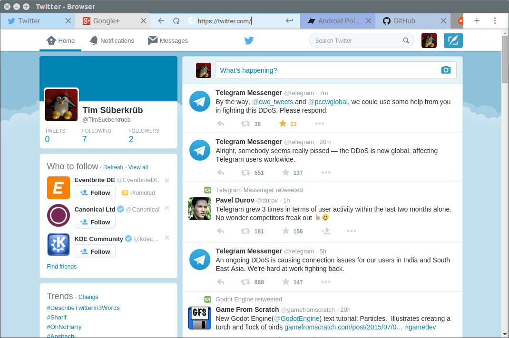
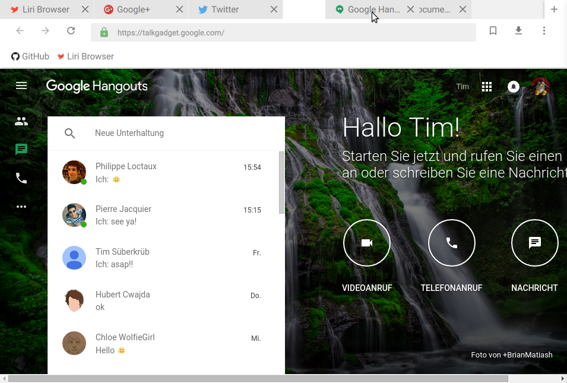

# Material Browser
A minimalistic material design web browser written for Papyros (https://github.com/papyros/)

See http://papyros.io for more information about Papyros.

## Screenshots

## Translations
Please help us translating this application! Read this guide to get started:
https://github.com/tim-sueberkrueb/material-browser/wiki/Translations

## Installation on Linux

### Simple Installation Script
If you just want to try material-browser out you can use our simple installation script. It will download and install Qt 5.5 and all necessary dependencies:

https://gist.github.com/tim-sueberkrueb/bdaae352cc6dcaca19b3

### Dependencies
* Qt 5.5 and QtWebEngine 1.1 (http://qt.io)
* qml-material (https://github.com/papyros/qml-material)
* qml-extras (https://github.com/papyros/qml-extras)

### Instructions
* Install Qt 5.5 (https://www.qt.io)
* Install qml-material
  * git clone https://github.com/papyros/qml-material.git
  * cd qml-material
  * qmake
  * make
  * make check # Optional, make sure everything is working correctly
  * sudo make install
* Install qml-extras
  * git clone https://github.com/papyros/qml-extras.git
  * cd qml-extras
  * qmake
  * make
  * make check # Optional, make sure everything is working correctly
  * sudo make install

### Build and Run
  * git clone https://github.com/tim-sueberkrueb/material-browser.git
  * cd material-browser
  * qmake
  * make
  * run material-browser executable

## Copyright and License
(C) Copyright 2015 by Tim Süberkrüb and contributors

See CONTRIBUTORS.md for a full list of contributors.

This application is free software: you can redistribute it and/or modify
it under the terms of the GNU General Public License as published by
the Free Software Foundation, either version 3 of the License, or
(at your option) any later version.

See LICENSE for more information.
